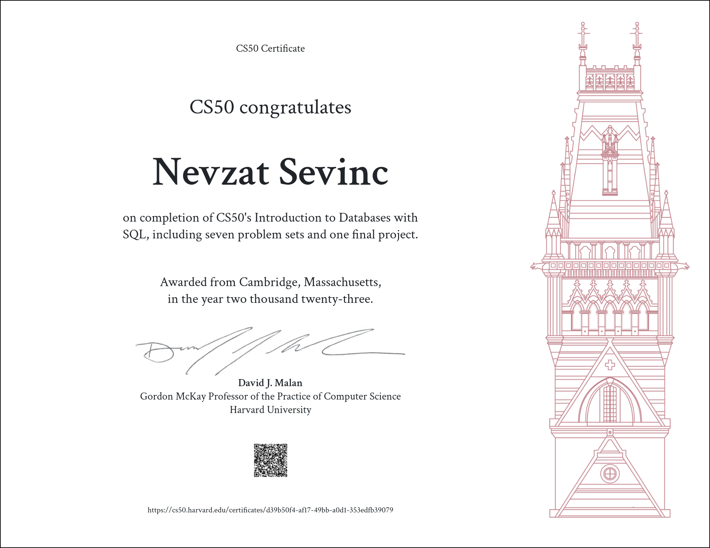

# CS50's Introduction to Databases with SQL

This repository contains my solutions to the problem sets and the final project of Harvard University's CS50's Introduction to Databases with SQL online course.

## About the course:
This is Harvard University's CS50 course offering a deep dive into databases using SQL. It covers Querying, Relating, Designing, Writing, Viewing, Optimizing, Scaling. The course begins with SQLite and progresses to PostgreSQL and MySQL, focusing on scalability. [official CS50 SQL website](https://cs50.harvard.edu/sql/2023/)

## Problem Sets
- [Problem Set 0](./problem_set_0) - Querying
- [Problem Set 1](./problem_set_1) - Relating
- [Problem Set 2](./problem_set_2) - Designing
- [Problem Set 3](./problem_set_3) - Writing
- [Problem Set 4](./problem_set_4) - Viewing
- [Problem Set 5](./problem_set_5) - Optimizing
- [Problem Set 6](./problem_set_6) - Scaling

## Final Project
- [SQL script for creating a healthcare database](./project)

## Contributing
This repository is for educational purposes, no contributions are required.

## License
This project is licensed under the MIT License. See [LICENSE](./LICENSE) for details.

## CS50 Certificate

