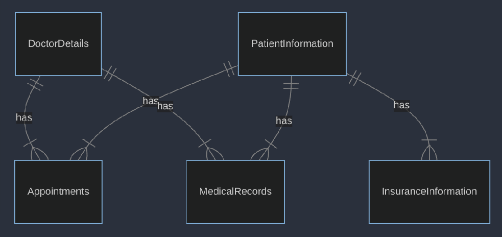

# Design Document

By Nevzat Sevinc

Video overview: <https://youtu.be/5d5NwIwLQKY>

## Scope

This database is designed to organize information on patient care. Its primary purpose is to facilitate easy access to patient records, doctor information, appointment scheduling, medical records, and medication details.

In Scope:
People: Doctors, Patients.
Processes: Appointment scheduling, medical record keeping, insurance information management.
Data: Doctor details, patient information, appointment dates and times, medical histories, medication information.

Out of Scope:
People: Non-medical staff.
Processes: Financial transactions (billing, payment processing).
Data: Detailed laboratory test results.

## Functional Requirements

User Capabilities:
Users can add, view, update, and delete patient details.
Access information about doctors, including specialties.
Users can create, view, update, and cancel appointments.
Access medical records.
Store and retrieve data about medications.

Beyond Scope
The system is not designed for direct messaging or telemedicine functionalities.

## Representation

Entities are captured in SQLite tables with the following schema.

### Entities

The database includes the following entities:

#### DoctorDetails
The DoctorDetails table includes:

DoctorID, data Type: INTEGER This is the primary key for the table. Being an INTEGER, it's efficient for indexing and searching.

FirstName, data Type: TEXT This field is set to NOT NULL, meaning it must always have a value. It stores the first name of the doctor.

LastName, data Type: TEXT This field is also NOT NULL, ensuring that every record has a last name value.

Specialty, data Type: TEXT This optional field can store the medical specialty of the doctor.

Email, data Type: TEXT This field is for storing the doctor's email address. It’s optional and not constrained to be unique in this structure.

Phone, data Type: TEXT This field is for the doctor's phone number.

#### PatientInformation
The PatientInformation table includes:

PatientID, Data Type: INTEGER This serves as the primary key of the table. The INTEGER data type is chosen for efficient indexing and searching.

FirstName, Data Type: TEXT This field, set to NOT NULL, ensures that a first name is always recorded for each patient. It stores the patient's first name.

LastName, Data Type: TEXT This field is also NOT NULL, guaranteeing that every patient record includes a last name.

DateOfBirth, Data Type: DATE This field records the patient’s date of birth. The DATE data type is used for storing dates.

Gender, Data Type: TEXT This field stores the gender of the patient.

Address, Data Type: TEXT This field is used for storing the patient's address.

Phone, Data Type: TEXT This field holds the patient's phone number.

Email, Data Type: TEXT This field is for storing the patient's email address.

InsuranceID, Data Type: INTEGER This field links the patient to their insurance information.

#### InsuranceInformation
The InsuranceInformation table includes:

InsuranceID, Data Type: INTEGER  This is the primary key of the table. Using an INTEGER for this ID facilitates efficient indexing and searching.

PatientID, Data Type: INTEGER This field represents the ID of the patient who holds the insurance policy. It is set to NOT NULL, ensuring that every insurance record is linked to a patient. As a foreign key, it references the PatientID in the PatientInformation table.

ProviderName, Data Type: TEXT This field, set to NOT NULL, stores the name of the insurance provider.

PolicyNumber, Data Type: TEXT This field, also set to NOT NULL, contains the policy number of the insurance.

CoverageDetails, Data Type: TEXT This optional field provides a space to store details about what the insurance policy covers.

ValidFrom, Data Type: DATE This field records the date from which the insurance coverage begins. The DATE data type is used to store specific calendar dates.

ValidUntil, Data Type: DATE Similar to ValidFrom, this field records the date on which the insurance coverage ends. Using the DATE data type allows for easy calculation of the insurance validity period.

#### Appointments
The Appointments table includes:

AppointmentID, Data Type: INTEGER Serving as the primary key of the table, this field uniquely identifies each appointment. The INTEGER data type is chosen for efficient indexing and searching.

PatientID, Data Type: INTEGER This field links the appointment to a specific patient. This field acts as a foreign key, referencing the PatientID in the PatientInformation table.

DoctorID, Data Type: INTEGER This field associates the appointment with a specific doctor. It is also set to NOT NULL and acts as a foreign key that references the DoctorID in the DoctorDetails table.

AppointmentDate, Data Type: DATE This field records the date of the appointment.

AppointmentTime, Data Type: TIME This field captures the time at which the appointment is scheduled. The TIME data type is suitable for recording specific times of the day.

Reason, Data Type: TEXT This optional field allows for recording the reason or purpose of the appointment.

#### MedicalRecords
The MedicalRecords table includes:

RecordID, Data Type: INTEGER This field is the primary key for the table. The INTEGER data type is used for efficient indexing and searching.

PatientID, Data Type: INTEGER This field links the medical record to a specific patient. This field acts as a foreign key, referencing the PatientID in the PatientInformation table.

VisitDate, Data Type: DATE This field records the date of the patient's visit or consultation. The DATE data type is suitable for recording specific calendar dates, which is important for chronological medical record-keeping.

DoctorID, Data Type: INTEGER This field associates the medical record with a specific doctor. This field serves as a foreign key that references the DoctorID in the DoctorDetails table.

Diagnosis, Data Type: TEXT This field is used to record the doctor's diagnosis of the patient's condition.

Treatment, Data Type: TEXT This field provides information about the treatment prescribed or recommended for the patient.

Notes, Data Type: TEXT This optional field can be used for additional notes.

#### Medications
The Medications table includes:

MedicationID, Data Type: INTEGER This field serves as the primary key for the table, uniquely identifying each medication entry. The INTEGER data type is chosen for its efficiency in indexing and searching within the database.

Name, Data Type: TEXT This field is set to NOT NULL, ensuring that every medication record includes the name of the medication.

Description, Data Type: TEXT This field provides a space for a more detailed explanation or background of the medication.

CommonUses, Data Type: TEXT This field is used to describe the typical uses or conditions the medication is prescribed for.

SideEffects, Data Type: TEXT This field lists potential side effects associated with the medication.

### Relationships

The below entity relationship diagram describes the relationships among the entities in the database.

Patient-Doctor Relationship: A many-to-many relationship exists, as one patient can have appointments with multiple doctors, and one doctor can see multiple patients.

Patient-Insurance Relationship: A one-to-many relationship, as one patient can have multiple insurance policies, but each policy is specific to one patient.

Doctor-Appointments and Patient-Appointments: These are many-to-one relationships, where multiple appointments can be linked to one doctor or one patient.

Patient-MedicalRecords Relationship: A one-to-many relationship, as one patient can have multiple medical records.

## Optimizations

Indexes: Created on frequently queried fields like LastName in DoctorDetails and PatientInformation, and AppointmentDate in Appointments for faster search and retrieval.

Views: Defined for each major entity (like DoctorContactInfo, PatientContactInfo) to simplify data access and hide the complexity of underlying schema.

## Limitations

The current design may struggle under extremely large datasets or high transaction volumes.

The database does not efficiently represent more complex relationships (e.g., multiple doctors per appointment).

This database provides a foundational structure for managing healthcare-related information, suitable for small to medium-sized healthcare facilities.
